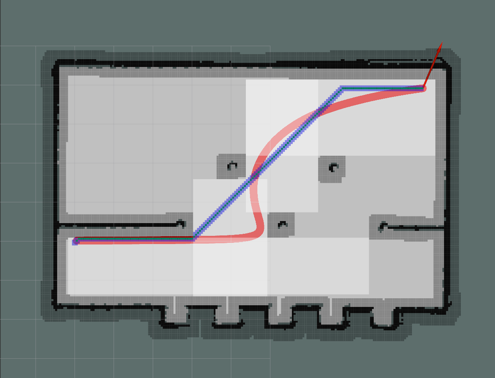

# BezierTrajGenerator

# 

## Dependeces
- [osqp](http://osqp.readthedocs.io/en/latest/index.html);
- [osqp-eigen](https://github.com/robotology/osqp-eigen);
- [Eigen3](http://eigen.tuxfamily.org/index.php?title=Main_Page);
- [cmake](https://cmake.org/);
- [Catch2](https://github.com/catchorg/Catch2) (only for testing).

# TODO

归一化提高数值稳定性和求解速度